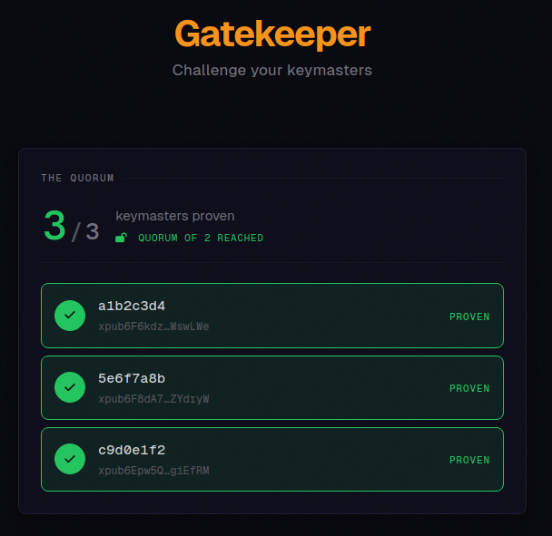
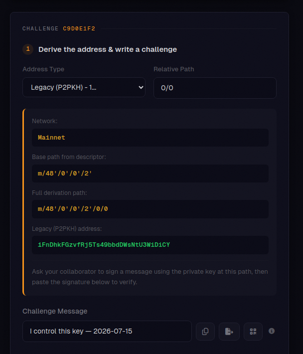
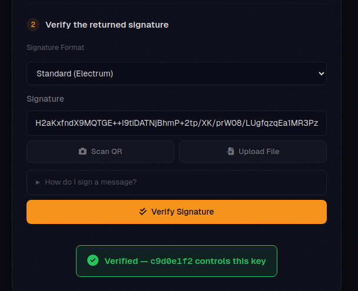
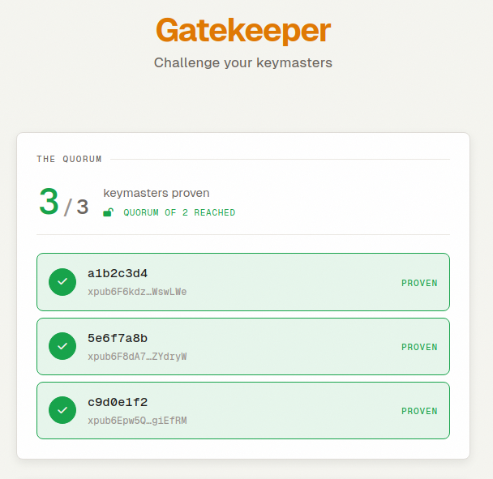

# Gatekeeper

**Challenge your keymasters.** Verify that your Bitcoin multisig cosigners actually control the keys they claim — by having them sign a message from a derived address, and validating the signature in your browser.

🔗 **Live:** [gatekeeper.dpinkerton.com](https://gatekeeper.dpinkerton.com)

Everything runs client-side. No descriptor, key, message, or signature ever leaves your browser.



---

## Why

A multisig wallet is only as trustworthy as your confidence that each cosigner holds a real, unique key — and can still access it. A descriptor lists extended public keys, but it can't prove anyone controls the matching private key.

Gatekeeper closes that gap. For each cosigner you issue a challenge message, they sign it with the key at the expected derivation path, and you verify the signature against the address derived from their xpub. Work through the wallet and you end up with proof — a quorum of keymasters who have demonstrably proven control.

Useful for onboarding a new multisig, periodic key-liveness checks, inheritance/recovery drills, or auditing a wallet someone else set up.

## How it works

1. **Load your wallet** — import a descriptor by file, paste, drag-and-drop, or QR scan.
2. **Pick a keymaster** — Gatekeeper extracts each cosigner's xpub and fingerprint and tracks who has proven control (M-of-N).
3. **Issue a challenge** — choose the address type and path, write a message, and hand it to the cosigner (copy, export to file, or a SeedSigner-ready signing QR).
4. **Verify the signature** — paste, scan, or upload their signature; Gatekeeper checks it against the derived address.
5. **Download a receipt** — a timestamped Markdown record of which keymasters proved control, safe to share.

| Issue a challenge | Verify the signature |
| --- | --- |
|  |  |

## Features

- **Descriptor input** — file (`.txt`/`.bsms`), paste, drag-and-drop, or camera QR scan
- **Multi-cosigner quorum tracking** — per-keymaster status and an M-of-N readout
- **Address types** — Legacy (P2PKH), Wrapped SegWit (P2SH-P2WPKH), Native SegWit (P2WPKH), Taproot (P2TR)
- **Signature formats** — Standard/Electrum, BIP-137 (Trezor), and BIP-322; format is auto-detected from the pasted signature
- **Signature input** — paste, scan a QR, or upload a `.txt`/`.sig` file
- **SeedSigner support** — generates a `signmessage` signing QR (multisig paths require [patched firmware](https://github.com/AusDavo/seedsigner/releases/tag/0.8.6-multisig-msg-signing); [background](https://blog.dpinkerton.com/posts/patching-seedsigner-multisig-message-signing/))
- **Mainnet & testnet** — network is detected automatically from the key prefix
- **Verification receipt** — downloadable Markdown summary
- **Light/dark themes**



### Compatibility notes

- **Taproot** uses Schnorr signatures (BIP-340); standard ECDSA message signing does not apply. Taproot verification requires the **BIP-322** format.
- Legacy addresses are verified with `bitcoinjs-message`; SegWit and BIP-322 signatures use `bip322-js`.
- Works with descriptors from Sparrow, Coldcard, SeedSigner, Nunchuk, and other coordinators. In-app help covers exporting the descriptor and signing a message for each.

## Privacy & security

- **Fully client-side.** All parsing, derivation, and verification happen in the browser — there is no backend and no network request carries your data.
- Gatekeeper only ever handles **public** keys and signatures. Never paste a private key or seed phrase; it doesn't ask for one and has no use for one.
- The app is a set of static files, so you can host it yourself or run it offline (see below).

## Run locally

```bash
git clone https://github.com/AusDavo/gatekeeper.git
cd gatekeeper
npm install
npm run build      # bundles main.js + modules into bundled.js
```

Then serve the folder with any static file server, for example:

```bash
npx serve .
# or: python3 -m http.server
```

Open the printed URL. To run offline, load `index.html` after building.

> The bundled output (`bundled.js`) is committed so the site can be served without a build step. If you change any JavaScript, re-run `npm run build` and commit the rebuilt bundle alongside your source changes.

## Tech stack

Plain JavaScript, bundled with [browserify](https://browserify.org/) — no framework, no runtime dependencies beyond the crypto libraries.

- [bitcoinjs-lib](https://github.com/bitcoinjs/bitcoinjs-lib) — address derivation
- [bip32](https://github.com/bitcoinjs/bip32) + [@bitcoinerlab/secp256k1](https://github.com/bitcoinerlab/secp256k1) — key derivation
- [bitcoinjs-message](https://github.com/bitcoinjs/bitcoinjs-message) — legacy signed-message verification
- [bip322-js](https://github.com/ACken2/bip322-js) — BIP-322 / SegWit verification
- [qrcode](https://github.com/soldair/node-qrcode) + [html5-qrcode](https://github.com/mebjas/html5-qrcode) — QR generation and scanning

Fonts (Geist Sans + Geist Mono) are self-hosted; the app makes no third-party requests for data.

## Project structure

```
index.html                  markup + pre-paint theme script
style.css                   design tokens (light/dark) + styles
main.js                     entry point
modules/                    UI, file/QR handling, multisig operations
bitcoin-utils.js            derivation & signature verification
bundled.js                  committed browserify bundle (built artifact)
fonts/                      self-hosted Geist woff2 files
```

## Deploying

Gatekeeper is a static site — commit the built `bundled.js` and serve the repository root with any static host (Caddy `file_server`, Nginx, GitHub Pages, Netlify, etc.). No server-side build or runtime is required.

## Contributing

Issues and pull requests are welcome. If your change touches JavaScript, rebuild the bundle (`npm run build`) and include the updated `bundled.js`. Run `npm run format` (Prettier) before submitting.

## Credits

Built by [David Pinkerton](https://dpinkerton.com/) with [bitcoinjs-lib](https://github.com/bitcoinjs/bitcoinjs-lib).

⚡ Support development: `gatekeeper@btcpay.dpinkerton.com`

## License

No license has been specified yet, so all rights are reserved by default. If you'd like to use or adapt Gatekeeper, please open an issue.
